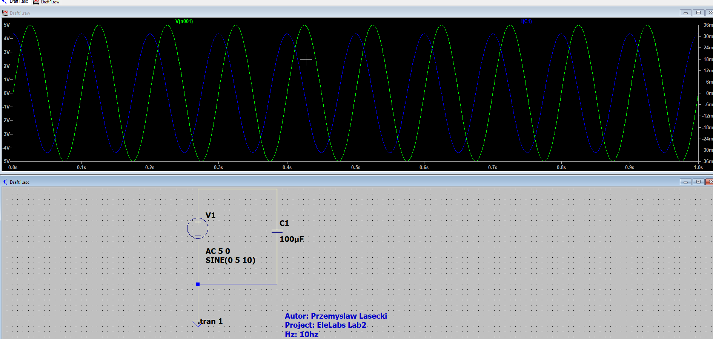
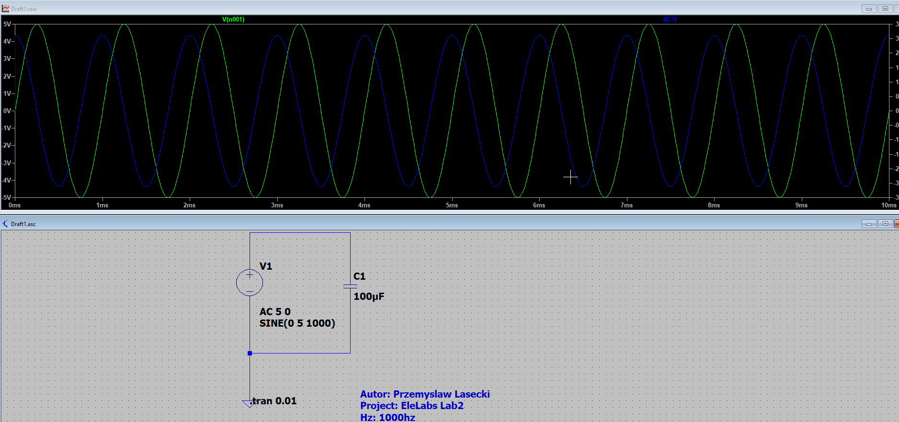
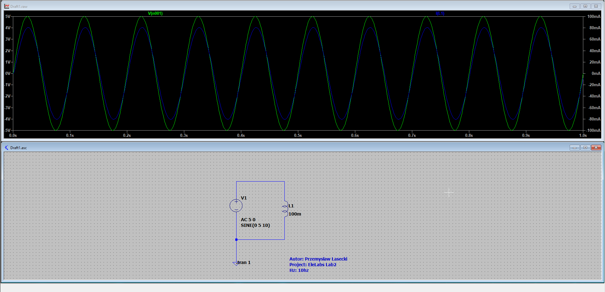
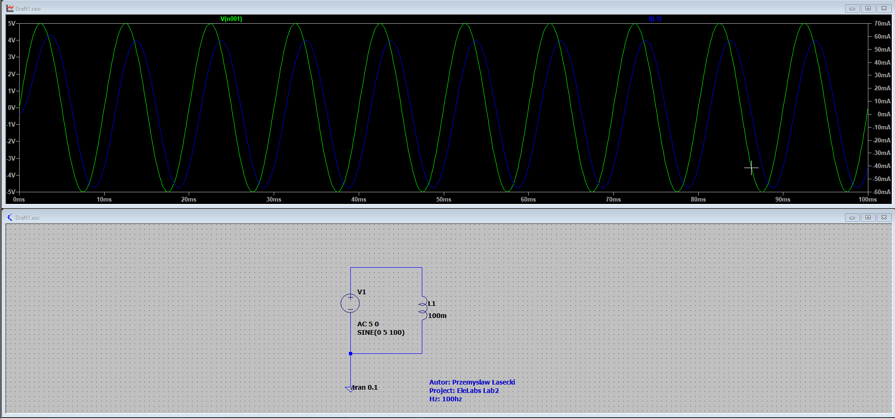
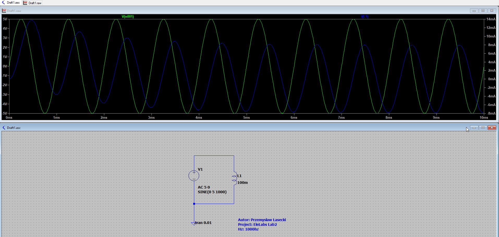
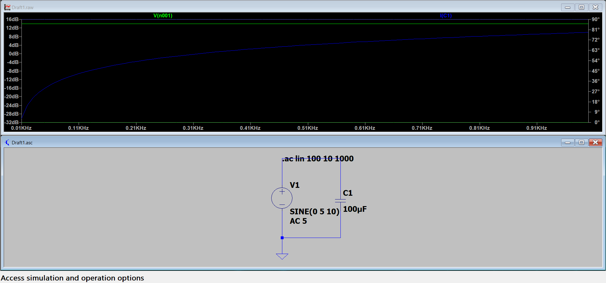
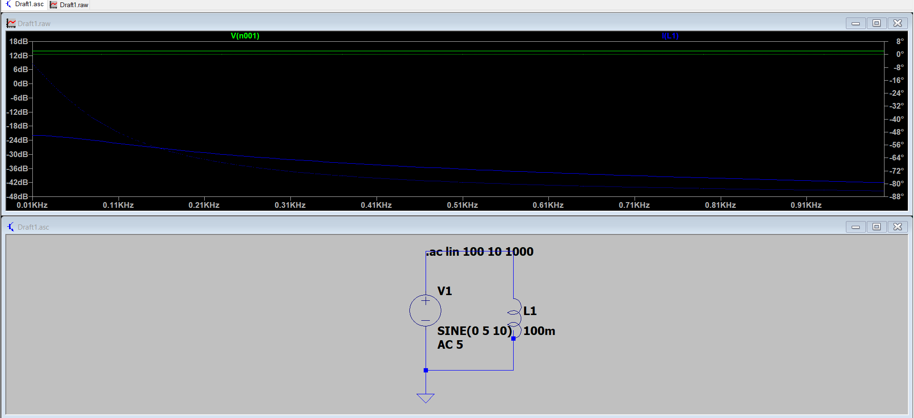
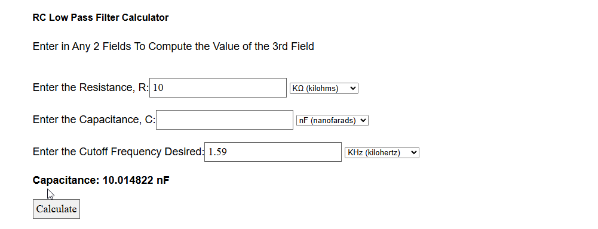
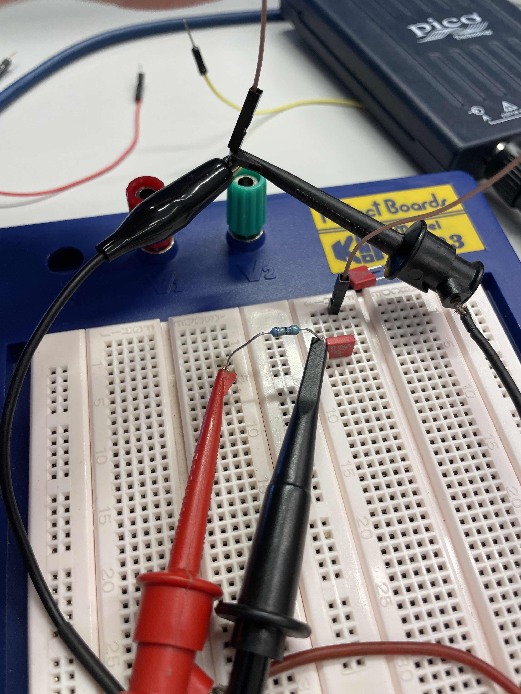

# Lab 2 – Observing AC Signals with Capacitors and Inductors

**Name:** Przemyslaw Lasecki  
**Course:** ELE Labs  
**Lab Title:** Lab 2 – Observing AC Signals with Capacitors and Inductors

### 1. Circuit Schematic

**Task 1: Impedance of a Capacitor (Capacitive Reactance)**

- **Circuit Description**: AC 5V source with a 100µF capacitor.
- **Part Numbers**: 100 µF capacitor, AC voltage source (amplitude based on last two digits of student number, my student number last digits are 35 so i will be using 5V).
- **Variable:** 10hz 100hz and 1000hz
- **Input/Output Designations**: Input is AC voltage, and output is voltage across and current through the capacitor.

**Schematic Diagram:**
10hz
 

**Schematic Diagram:**
100hz
 

**Schematic Diagram:**
1000hz
 
---

**Task 2: Impedance of an Inductor (Inductive Reactance)**

- **Circuit Description**: AC voltage source with a 100mH inductor (PCH-45X-107 Coilcraft).
- **Part Numbers**: 100mH inductor, AC voltage source.

**Schematic Diagram:** 
10hz 
 

**Schematic Diagram:**
100hz
 

**Schematic Diagram:** 
1000hz
 
---

**Task 3: Frequency Response of Capacitor and Inductor**

- **Circuit Description**: Same circuits as Tasks 1 and 2, but now using AC analysis to observe frequency response.
- **Part Numbers**: 100µF capacitor, 100mH inductor, AC voltage source.

**Schematic Diagram:**
 

**Schematic Diagram:**
 

---

**Task 4: Measuring the RC Low-Pass Filter**

- **Circuit Description**: Resistor (10kΩ) and calculated capacitor value to form an RC low-pass filter.
- **Part Numbers**: 10kΩ resistor, 47nF, PicoScope 2000 signal generator (1V sine wave input).
- **Pin Designations**: Label connections to PicoScope’s output and oscilloscope channels A (input) and B (output).
- **Input/Output Designations**: Input is PicoScope signal, output is measured with the oscilloscope.
- **External Connections**: Connections to the signal generator and oscilloscope.

**Schematic Diagram:**

